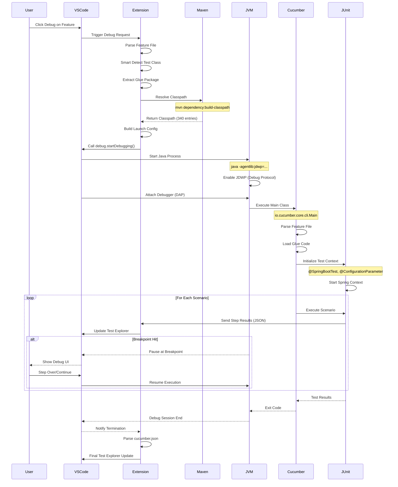
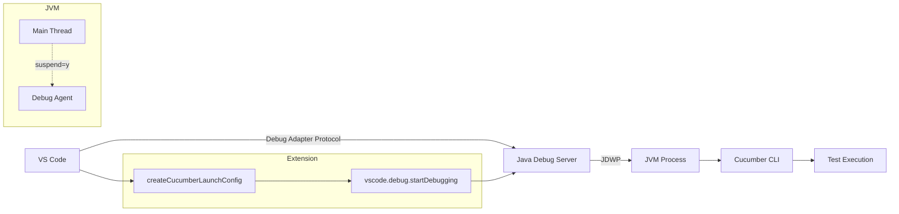
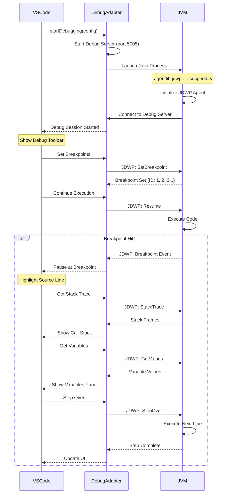
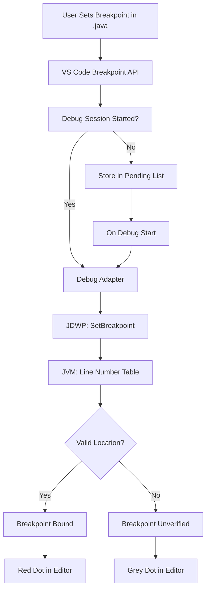
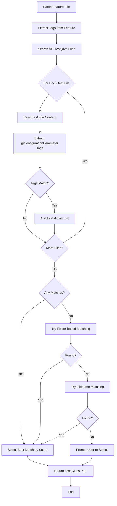
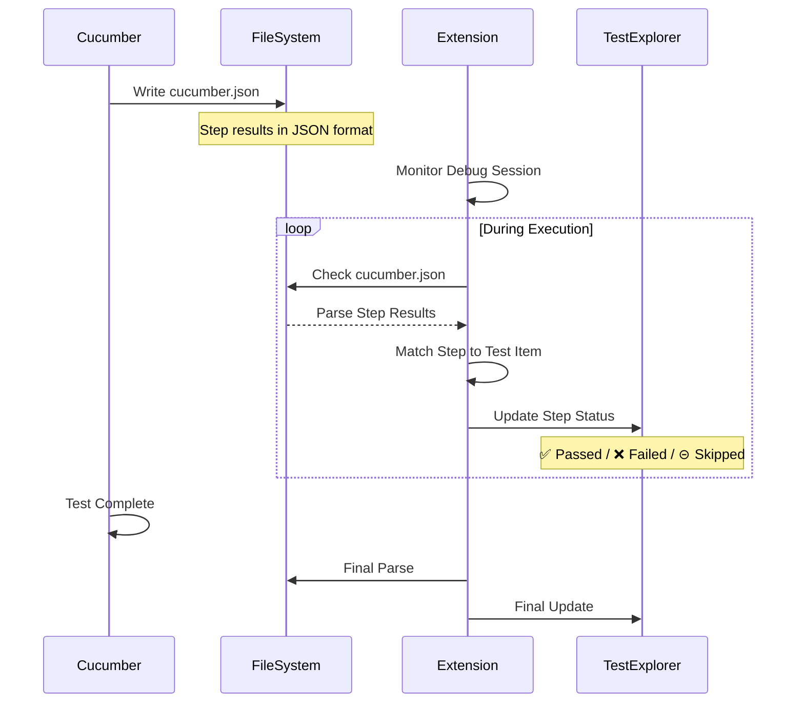

# Cucumber Java Easy Runner - Technical Overview

**Version**: v23.37  
**Last Updated**: 2025-11-12

---

## 📋 Table of Contents

1. [Feature Overview](#feature-overview)
2. [Architecture](#architecture)
3. [Maven Cucumber JUnit Integration](#maven-cucumber-junit-integration)
4. [VS Code Debug Integration](#vs-code-debug-integration)
5. [Technical Deep Dive](#technical-deep-dive)
6. [Performance Optimizations](#performance-optimizations)
7. [Configuration Reference](#configuration-reference)

---

## Feature Overview

### Core Features (v23.37)

#### 1. Smart Test Class Detection (v23.3)

**功能**: 自動根據 feature 檔案找到對應的測試類別

**實作**:
- **策略 1 (Priority)**: Tag-based matching
  - 從 feature 提取 `@tag_name`
  - 從所有 `*Test.java` 提取 `@ConfigurationParameter(key = FILTER_TAGS_PROPERTY_NAME, value = "...")`
  - 比對 tag 找到對應的測試類別

- **策略 2 (Fallback)**: Folder-based matching
  - 從 feature 路徑提取資料夾名稱 (e.g., `MKT05A06`)
  - 搜尋包含該資料夾名稱的測試類別

- **策略 3 (Last Resort)**: Filename-based matching
  - 從 feature 檔名提取關鍵字
  - 模糊匹配測試類別名稱

**範例**:
```gherkin
# Feature: MKT05A06R01-mktSegment_CriteriaUpdate.feature
@mkt_segment_criteria_update_test
Scenario: 創建新 segment
```

```java
// Test Class: MktSegmentCriteriaUpdateTest.java
@ConfigurationParameter(
    key = Constants.FILTER_TAGS_PROPERTY_NAME,
    value = "@mkt_segment_criteria_update_test")
public class MktSegmentCriteriaUpdateTest {
    // ...
}
```

**結果**: ✅ 自動匹配到 `MktSegmentCriteriaUpdateTest`

---

#### 2. Glue Package Extraction (v23.31)

**功能**: 從測試類別提取正確的 glue package

**問題**: 舊版使用 path-based extraction 會出錯

**解決方案**: 讀取 `@ConfigurationParameter(key = GLUE_PROPERTY_NAME, value = "...")`

**實作**:
```typescript
async function extractGluePackageFromTestClass(testClassPath: string): Promise<string | null> {
  const content = fs.readFileSync(testClassPath, 'utf8');
  
  // 正則表達式匹配 @ConfigurationParameter
  const glueParamRegex = /@ConfigurationParameter\s*\(\s*key\s*=\s*Constants\.GLUE_PROPERTY_NAME\s*,\s*value\s*=\s*"([^"]+)"/gs;
  
  const match = glueParamRegex.exec(content);
  if (match && match[1]) {
    return match[1].trim();
  }
  
  return null; // Fallback to path-based
}
```

**範例**:
```java
@ConfigurationParameter(
    key = Constants.GLUE_PROPERTY_NAME,
    value = "tw.datahunter.spring.system")  // ← 正確的 glue package
```

**結果**: `--glue tw.datahunter.spring.system` ✅

---

#### 3. Multi-Module Support (v23.32)

**功能**: 支援多模組 Maven 專案

**問題**: 舊版使用 workspace root 作為 cwd,導致 Spring Boot 找不到 `application.yml`

**解決方案**: 使用 module path 作為 working directory

**實作**:
```typescript
// debug-integration.ts
export function createCucumberLaunchConfig(
  workspaceFolder: vscode.WorkspaceFolder,
  cucumberArgs: string[],
  classPaths: string[],
  isDebug: boolean,
  modulePath?: string,  // ← NEW
  // ...
) {
  const workingDirectory = modulePath || workspaceFolder.uri.fsPath;
  
  return {
    type: 'java',
    mainClass: 'io.cucumber.core.cli.Main',
    cwd: workingDirectory,  // ← Use module path
    // ...
  };
}
```

**專案結構**:
```
/workspace/
├── module-a/
│   ├── pom.xml
│   └── src/main/resources/application.yml  ← 需要在這裡找到
└── module-b/
```

**結果**: `cwd = /workspace/module-a` ✅

---

#### 4. Configurable Auto-Compile (v23.37)

**功能**: 測試前自動編譯可配置

**設定**:
```json
{
  "cucumberJavaEasyRunner.autoCompileBeforeTest": false  // 預設: 關閉
}
```

**實作**:
```typescript
const config = vscode.workspace.getConfiguration('cucumberJavaEasyRunner');
const autoCompile = config.get<boolean>('autoCompileBeforeTest', false);

if (autoCompile) {
  // 執行 mvn compile test-compile (~13 秒)
} else {
  // 跳過編譯 (0 秒)
}
```

**效能對比**:
- `false`: ~3 秒啟動 ⚡
- `true`: ~16 秒啟動 🐌

---

## Architecture

### System Architecture

```mermaid
graph TB
    A[User: Click Debug] --> B[Extension Activation]
    B --> C[Feature File Parser]
    C --> D[Smart Test Class Detection]
    D --> E{Detection Strategy}
    E -->|Priority 1| F[Tag-based Matching]
    E -->|Priority 2| G[Folder-based Matching]
    E -->|Priority 3| H[Filename-based Matching]
    F --> I[Test Class Found]
    G --> I
    H --> I
    I --> J[Extract Glue Package]
    J --> K{Glue Source}
    K -->|Priority 1| L[@ConfigurationParameter]
    K -->|Priority 2| M[Path-based]
    L --> N[Maven Classpath Resolution]
    M --> N
    N --> O{Auto Compile?}
    O -->|true| P[mvn compile test-compile]
    O -->|false| Q[Skip Compilation]
    P --> R[mvn dependency:build-classpath]
    Q --> R
    R --> S[Build Launch Config]
    S --> T[VS Code Debug API]
    T --> U[JVM with JDWP]
    U --> V[Cucumber CLI Execution]
    V --> W[Real-time Step Updates]
    W --> X[Test Explorer Sync]
```

---

### Module Structure

```
cucumber-java-easy-runner/
├── src/
│   ├── extension.ts          # 主入口點
│   ├── debug-integration.ts  # Debug 整合
│   ├── maven-utils.ts        # Maven 工具
│   ├── test-discovery.ts     # 測試發現
│   └── test-execution.ts     # 測試執行
├── package.json              # Extension 配置
└── docs/
    └── TECHNICAL_OVERVIEW.md # 本文件
```

---

## Maven Cucumber JUnit Integration

### Integration Flow



---

### Key Components

#### 1. Maven Classpath Resolution

**目的**: 取得執行 Cucumber 需要的所有 JAR 檔案

**流程**:
```typescript
async function resolveMavenClasspath(projectRoot: string): Promise<string[]> {
  // Step 1: 自動編譯 (可選)
  if (autoCompile) {
    await execFileAsync('mvn', ['compile', 'test-compile', '-q'], { cwd: projectRoot });
  }
  
  // Step 2: 解析依賴
  const cpFile = `/tmp/cucumber-cp-${Date.now()}.txt`;
  await execFileAsync('mvn', [
    '-q',
    '-DincludeScope=test',
    'dependency:build-classpath',
    `-Dmdep.outputFile=${cpFile}`
  ], { cwd: projectRoot });
  
  // Step 3: 讀取 classpath
  const depsClasspath = fs.readFileSync(cpFile, 'utf8').trim();
  
  // Step 4: 組合完整 classpath
  const classpaths = [
    `${projectRoot}/target/test-classes`,  // 測試類別
    `${projectRoot}/target/classes`,       // 主程式類別
    ...depsClasspath.split(':')            // Maven 依賴 (340+ JARs)
  ];
  
  return classpaths;
}
```

**輸出範例**:
```
/project/target/test-classes
/project/target/classes
/home/user/.m2/repository/io/cucumber/cucumber-java/7.14.0/cucumber-java-7.14.0.jar
/home/user/.m2/repository/io/cucumber/cucumber-spring/7.14.0/cucumber-spring-7.14.0.jar
/home/user/.m2/repository/org/springframework/boot/spring-boot-starter-test/3.2.0/...
... (340+ entries)
```

---

#### 2. Cucumber CLI Arguments

**建構指令**:
```typescript
function buildCucumberArgs(
  featurePath: string,
  gluePackage: string,
  lineNumber?: number,
  modulePath?: string
): string[] {
  const args = [
    '--glue', gluePackage,                              // Step definitions 位置
    '--plugin', 'pretty',                               // Console output
    '--plugin', 'html:target/cucumber-reports/cucumber.html',
    '--plugin', 'json:target/cucumber-reports/cucumber.json',
    lineNumber ? `${featurePath}:${lineNumber}` : featurePath
  ];
  
  return args;
}
```

**執行指令範例**:
```bash
java -agentlib:jdwp=transport=dt_socket,server=n,suspend=y,address=localhost:5005 \
  -cp "/project/target/test-classes:/project/target/classes:..." \
  io.cucumber.core.cli.Main \
  --glue tw.datahunter.spring.system \
  --plugin pretty \
  --plugin html:target/cucumber-reports/cucumber.html \
  --plugin json:target/cucumber-reports/cucumber.json \
  /path/to/feature.feature:17
```

---

#### 3. JUnit Platform Integration

**測試類別結構**:
```java
@SpringBootTest(webEnvironment = WebEnvironment.RANDOM_PORT)
@ConfigurationParameter(
    key = Constants.GLUE_PROPERTY_NAME,
    value = "tw.datahunter.spring.system")
@ConfigurationParameter(
    key = Constants.FILTER_TAGS_PROPERTY_NAME,
    value = "@mkt_segment_criteria_update_test")
public class MktSegmentCriteriaUpdateTest {
    
    @Given("[MKT05A06] 還原測試資料")
    public void restoreTestData() {
        // Step implementation
    }
    
    @When("[MKT05A06] 創建動態分眾")
    public void createSegment() {
        // Step implementation
    }
    
    @Then("[MKT05A06] 驗證分眾創建成功")
    public void verifySegmentCreated() {
        // Step implementation
    }
}
```

**執行流程**:
1. Cucumber CLI 啟動
2. 載入 `@ConfigurationParameter` 設定
3. 掃描 glue package 找到 step definitions
4. JUnit Platform 初始化 Spring Context
5. 執行 scenario steps
6. 輸出結果到 `cucumber.json`

---

## VS Code Debug Integration

### Debug Architecture



---

### Launch Configuration

**生成 Debug Config**:
```typescript
function createCucumberLaunchConfig(
  workspaceFolder: vscode.WorkspaceFolder,
  cucumberArgs: string[],
  classPaths: string[],
  isDebug: boolean,
  modulePath?: string,
  projectName?: string,
  sourcePaths?: string[]
): CucumberLaunchDebugConfig {
  
  return {
    type: 'java',
    name: isDebug ? 'Debug Cucumber Test' : 'Run Cucumber Test',
    request: 'launch',                    // Launch mode (not attach)
    mainClass: 'io.cucumber.core.cli.Main',
    args: cucumberArgs,
    projectName: projectName || workspaceFolder.name,
    sourcePaths: sourcePaths || [
      'src/test/java',
      'src/main/java',
      '*/src/test/java',
      '*/src/main/java'
    ],
    classPaths: classPaths,               // 340+ entries
    console: 'integratedTerminal',
    cwd: modulePath || workspaceFolder.uri.fsPath,
    noDebug: !isDebug
  };
}
```

---

### JDWP (Java Debug Wire Protocol)

**啟動參數**:
```
-agentlib:jdwp=transport=dt_socket,server=n,suspend=y,address=localhost:5005
```

**參數說明**:
- `transport=dt_socket`: 使用 TCP/IP socket 傳輸
- `server=n`: JVM 作為客戶端,連接到 debug server
- `suspend=y`: 暫停執行,等待 debugger attach
- `address=localhost:5005`: Debug server 位址

**連接流程**:


---

### Breakpoint Management

**設定 Breakpoint**:
```typescript
// VS Code 會自動管理 breakpoints
const breakpoints = vscode.debug.breakpoints;

// Extension 不需要手動設定
// Debug Adapter 會通過 JDWP 協議傳送給 JVM
```

**Breakpoint 綁定流程**:


---

### Debug UI Synchronization

**VS Code Debug UI 更新**:

1. **Call Stack Panel**
   - JDWP: `StackTrace` 命令
   - 顯示方法調用層級

2. **Variables Panel**
   - JDWP: `GetValues` 命令
   - 顯示區域變數、實例變數

3. **Watch Panel**
   - JDWP: `Evaluate` 命令
   - 執行表達式求值

4. **Source Code Highlighting**
   - JDWP: 返回檔案路徑和行號
   - VS Code 自動開啟並高亮該行

**問題**: VS Code 沒有自動跳轉到中斷點

**原因分析**:
```typescript
// 可能的問題點:
{
  sourcePaths: [
    'src/test/java',
    'src/main/java',
    '*/src/test/java',  // ← 萬用字元可能導致路徑解析問題
    '*/src/main/java'
  ]
}
```

**解決方案 (待實作)**:
```typescript
// 使用絕對路徑
const absoluteSourcePaths = sourcePaths.map(sp => {
  if (path.isAbsolute(sp)) {
    return sp;
  }
  return path.resolve(modulePath || workspaceFolder.uri.fsPath, sp);
});

// 或明確指定模組路徑
sourcePaths: [
  `${modulePath}/src/test/java`,
  `${modulePath}/src/main/java`
]
```

---

## Technical Deep Dive

### 1. Smart Test Class Detection Algorithm



**實作代碼**:
```typescript
async function smartDetectTestClass(
  featurePath: string,
  workspaceRoot: string
): Promise<string | null> {
  
  // 1. Extract tags from feature
  const featureTags = await extractTagsFromFeature(featurePath);
  log(`Feature tags: [${featureTags.join(', ')}]`);
  
  // 2. Find all test files
  const testFiles = await findAllTestFiles(workspaceRoot);
  log(`Searching ${testFiles.length} test files...`);
  
  // 3. Tag-based matching
  const tagMatches: Array<{path: string, score: number}> = [];
  
  for (const testFile of testFiles) {
    const testTags = await extractTagsFromTestClass(testFile);
    const commonTags = featureTags.filter(tag => testTags.includes(tag));
    
    if (commonTags.length > 0) {
      tagMatches.push({
        path: testFile,
        score: commonTags.length
      });
      log(`Match found: ${path.basename(testFile)} - ${commonTags.length} common tags`);
    }
  }
  
  // 4. Select best match
  if (tagMatches.length > 0) {
    tagMatches.sort((a, b) => b.score - a.score);
    const bestMatch = tagMatches[0];
    log(`⭐ Tag-based match selected: ${path.basename(bestMatch.path)} (score: ${bestMatch.score})`);
    return bestMatch.path;
  }
  
  // 5. Fallback to folder-based matching
  const folderName = extractFolderName(featurePath); // e.g., "MKT05A06"
  const folderMatch = testFiles.find(f => f.includes(folderName));
  if (folderMatch) {
    log(`⭐ Folder-based match: ${path.basename(folderMatch)}`);
    return folderMatch;
  }
  
  // 6. Fallback to filename matching
  const featureBaseName = path.basename(featurePath, '.feature');
  const filenameMatch = testFiles.find(f => {
    const testBaseName = path.basename(f, '.java');
    return similarity(featureBaseName, testBaseName) > 0.6;
  });
  
  if (filenameMatch) {
    log(`⭐ Filename-based match: ${path.basename(filenameMatch)}`);
    return filenameMatch;
  }
  
  // 7. No match found
  log(`❌ No test class found for ${featurePath}`);
  return null;
}
```

---

### 2. Tag Extraction with String Concatenation

**挑戰**: Java 中 tags 可能用字串連接表示

```java
@ConfigurationParameter(
    key = Constants.FILTER_TAGS_PROPERTY_NAME,
    value = "@tag1 " +
            "or @tag2 " +
            "or @tag3")
```

**解決方案**: 正則表達式匹配整個 value block

```typescript
async function extractTagsFromTestClass(testClassPath: string): Promise<string[]> {
  const content = fs.readFileSync(testClassPath, 'utf8');
  
  // 匹配 @ConfigurationParameter 整個區塊
  const configParamRegex = /@ConfigurationParameter\s*\(\s*key\s*=\s*Constants\.FILTER_TAGS_PROPERTY_NAME\s*,\s*value\s*=\s*"([^"]+)"([^)]+)\)/gs;
  
  const match = configParamRegex.exec(content);
  if (!match) {
    return [];
  }
  
  // 提取第一個雙引號內的 tag
  let tagsText = match[1];
  
  // 提取後續連接的字串
  const valueBlock = match[2];
  const stringConcatRegex = /\+\s*"([^"]+)"/g;
  let concatMatch;
  
  while ((concatMatch = stringConcatRegex.exec(valueBlock)) !== null) {
    tagsText += ' ' + concatMatch[1];
  }
  
  // 解析 tags
  const tagRegex = /@(\w+)/g;
  const tags: string[] = [];
  let tagMatch;
  
  while ((tagMatch = tagRegex.exec(tagsText)) !== null) {
    tags.push(tagMatch[1]);
  }
  
  return tags;
}
```

**測試案例**:
```typescript
// Input:
@ConfigurationParameter(
    key = Constants.FILTER_TAGS_PROPERTY_NAME,
    value = "@tag1 " +
            "or @tag2 " +
            "or @tag3")

// Output:
['tag1', 'tag2', 'tag3']
```

---

### 3. Real-time Step Updates

**流程**:


**實作**:
```typescript
async function onStepUpdate(stepText: string, status: string, errorMessage?: string) {
  log(`onStepUpdate called: "${stepText}" - ${status}`);
  
  // 1. Find matching step item in Test Explorer
  const stepItem = stepItemsMap.get(stepText);
  
  if (!stepItem) {
    log(`❌ No matching step found in stepItemsMap`);
    
    // Check if it's a Background/Before hook
    if (isBackgroundStep(stepText)) {
      // Create dynamic background step
      const bgStep = createBackgroundStep(stepText, scenario);
      stepItemsMap.set(stepText, bgStep);
      stepItem = bgStep;
    } else {
      return;
    }
  }
  
  // 2. Update Test Explorer UI
  switch (status) {
    case 'passed':
      testRun.passed(stepItem);
      log(`✅ Step PASSED: ${stepText}`);
      break;
      
    case 'failed':
      testRun.failed(stepItem, new vscode.TestMessage(errorMessage || 'Step failed'));
      log(`❌ Step FAILED: ${stepText}`);
      log(`  Error: ${errorMessage}`);
      break;
      
    case 'skipped':
      testRun.skipped(stepItem);
      log(`⊝ Step SKIPPED: ${stepText}`);
      break;
  }
}
```

---

## Performance Optimizations

### 1. Tag Cache

**目的**: 避免重複解析測試類別檔案

```typescript
interface TagCacheEntry {
  tags: string[];
  mtime: number;  // File modification time
}

const tagCache = new Map<string, TagCacheEntry>();

async function extractTagsFromTestClass(testClassPath: string): Promise<string[]> {
  const stats = fs.statSync(testClassPath);
  const cached = tagCache.get(testClassPath);
  
  // Check cache validity
  if (cached && cached.mtime === stats.mtimeMs) {
    log(`[Cache Hit] ${path.basename(testClassPath)}`);
    return cached.tags;
  }
  
  // Extract tags
  const tags = await parseTagsFromFile(testClassPath);
  
  // Update cache
  tagCache.set(testClassPath, {
    tags,
    mtime: stats.mtimeMs
  });
  
  return tags;
}
```

**效能提升**:
- 首次掃描: ~500ms (92 files)
- 快取命中: ~10ms ✅

---

### 2. Auto-Compile Toggle

**時間對比**:

| 階段 | autoCompile=false | autoCompile=true | 節省 |
|------|------------------|------------------|------|
| 編譯 | 0 秒 | ~13 秒 | 13 秒 |
| 依賴解析 | ~3 秒 | ~3 秒 | 0 秒 |
| **總計** | **~3 秒** | **~16 秒** | **81%** ⚡ |

---

### 3. Classpath Caching (未實作,建議)

**概念**: 快取已解析的 classpath

```typescript
interface ClasspathCache {
  projectRoot: string;
  pomMtime: number;
  classpaths: string[];
}

let classpathCache: ClasspathCache | null = null;

async function resolveMavenClasspath(projectRoot: string): Promise<string[]> {
  const pomPath = path.join(projectRoot, 'pom.xml');
  const pomStats = fs.statSync(pomPath);
  
  // Check cache
  if (classpathCache 
      && classpathCache.projectRoot === projectRoot
      && classpathCache.pomMtime === pomStats.mtimeMs) {
    log('[Cache Hit] Using cached classpath');
    return classpathCache.classpaths;
  }
  
  // Resolve classpath
  const classpaths = await doResolveMavenClasspath(projectRoot);
  
  // Update cache
  classpathCache = {
    projectRoot,
    pomMtime: pomStats.mtimeMs,
    classpaths
  };
  
  return classpaths;
}
```

**預期效能提升**:
- 首次解析: ~3 秒
- 快取命中: ~100ms ✅ (30x 提升)

---

## Configuration Reference

### Extension Settings

| 設定 | 類型 | 預設值 | 說明 |
|------|------|--------|------|
| `enableCodeLens` | boolean | `false` | 啟用 CodeLens 按鈕 |
| `executionMode` | string | `"java"` | 執行模式: `java` 或 `maven` |
| `autoCompileBeforeTest` | boolean | `false` | 測試前自動編譯 ⭐ v23.37 |
| `rememberTestClass` | boolean | `true` | 記住測試類別對應 |
| `showStepResults` | boolean | `true` | 顯示即時步驟結果 |
| `debug.enabled` | boolean | `true` | 啟用 debug 支援 |
| `debug.port` | number | `5005` | Debug 埠號 |
| `debug.suspend` | boolean | `true` | 暫停等待 debugger |

---

### Launch Configuration Template

```json
{
  "type": "java",
  "name": "Debug Cucumber Test",
  "request": "launch",
  "mainClass": "io.cucumber.core.cli.Main",
  "args": [
    "--glue", "com.example.steps",
    "--plugin", "pretty",
    "--plugin", "json:target/cucumber-reports/cucumber.json",
    "/path/to/feature.feature:17"
  ],
  "projectName": "my-project",
  "sourcePaths": [
    "src/test/java",
    "src/main/java"
  ],
  "classPaths": [
    "/project/target/test-classes",
    "/project/target/classes",
    "... (340+ Maven dependencies)"
  ],
  "console": "integratedTerminal",
  "cwd": "/path/to/module",
  "noDebug": false
}
```

---

## Troubleshooting

### Common Issues

#### 1. VS Code 沒有跳轉到斷點

**症狀**: Breakpoint 觸發但 VS Code 沒有自動開啟檔案

**可能原因**:
- `sourcePaths` 配置不正確
- 萬用字元路徑解析失敗
- 檔案路徑大小寫不一致 (Linux/Windows)

**解決方案**:
```typescript
// 使用絕對路徑
sourcePaths: [
  path.join(modulePath, 'src/test/java'),
  path.join(modulePath, 'src/main/java')
]
```

---

#### 2. ClassNotFoundException

**症狀**: 執行時找不到類別

**可能原因**:
- `autoCompileBeforeTest = false` 但未手動編譯
- `target/test-classes` 不存在

**解決方案**:
```bash
# 手動編譯
mvn compile test-compile

# 或啟用自動編譯
{
  "cucumberJavaEasyRunner.autoCompileBeforeTest": true
}
```

---

#### 3. Spring Context 載入失敗

**症狀**: `Config data resource 'application.yml' cannot be found`

**可能原因**:
- `cwd` 設定為 workspace root 而非 module path

**解決方案**:
- 已在 v23.32 修正
- 確保使用最新版本

---

## Version History

### v23.37 (2025-11-12)
- ✅ 自動編譯功能參數化
- ⚙️ 新增 `autoCompileBeforeTest` 設定 (預設: false)

### v23.32 (2025-11-12)
- ✅ 多模組專案支援
- 🔧 使用 module path 作為 cwd

### v23.31 (2025-11-11)
- ✅ 從 @ConfigurationParameter 提取 glue package
- 🐛 修正 Spring Context 配置錯誤

### v23.3 (2025-11-11)
- ✅ 改用 @ConfigurationParameter 提取 tag
- ✅ 支援 Cucumber 7+ 註解格式
- ✅ 支援字串連接的 tag 值

---

## Future Improvements

### Planned Features

1. **Classpath Caching**
   - 快取 Maven classpath 解析結果
   - 僅在 pom.xml 變更時重新解析
   - 預期效能提升: 30x

2. **Source Path Auto-Detection**
   - 自動解析多模組專案的 source paths
   - 避免萬用字元導致的路徑問題

3. **Debug UI Enhancement**
   - 自動跳轉到斷點位置
   - Step-by-step 執行時同步 UI

4. **Test Report Generation**
   - 整合 Cucumber HTML report
   - VS Code 內建 report viewer

5. **Parallel Execution**
   - 支援多個 scenario 並行執行
   - 加速大型測試套件

---

## References

### Official Documentation

- [VS Code Extension API](https://code.visualstudio.com/api)
- [Debug Adapter Protocol](https://microsoft.github.io/debug-adapter-protocol/)
- [Java Debug Wire Protocol (JDWP)](https://docs.oracle.com/javase/8/docs/technotes/guides/jpda/jdwp-spec.html)
- [Cucumber JVM](https://cucumber.io/docs/cucumber/)
- [JUnit 5 Platform](https://junit.org/junit5/docs/current/user-guide/)

### Related Projects

- [vscode-java-debug](https://github.com/microsoft/vscode-java-debug)
- [vscode-java-test](https://github.com/microsoft/vscode-java-test)
- [cucumber-jvm](https://github.com/cucumber/cucumber-jvm)

---

**Document Version**: 1.0  
**Last Updated**: 2025-11-12  
**Author**: Development Team  
**Status**: ✅ Current
