# Cucumber Java Easy Runner - 運作流程圖

本文件使用 Mermaid 圖表說明擴充套件的各種運作流程。

## 1. 擴充套件啟動流程

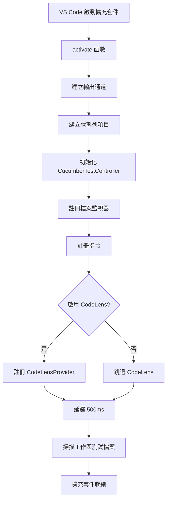

## 2. 測試探索流程

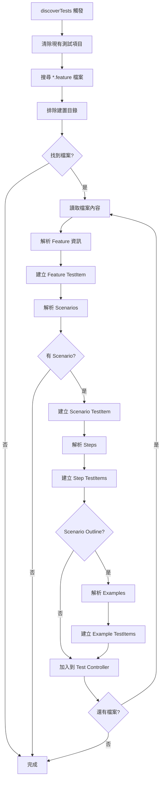

## 3. 功能檔案解析流程

```mermaid
flowchart TD
    A[parseFeatureFile] --> B[分割檔案為行]
    B --> C{處理每一行}
    C --> D{Feature:?}
    D -->|是| E[儲存 Feature 名稱]
    D -->|否| F{Scenario:?}
    E --> C
    F -->|是| G[建立新 ScenarioInfo]
    F -->|否| H{Scenario Outline:?}
    G --> I[加入到 scenarios 陣列]
    I --> C
    H -->|是| J[建立 Outline ScenarioInfo]
    H -->|否| K{以 | 開頭?}
    J --> I
    K -->|是| L{在 Examples 區塊?}
    K -->|否| M{Given/When/Then/And/But?}
    L -->|是| N[建立 ExampleInfo]
    L -->|否| C
    N --> O[加入到 currentScenario.examples]
    O --> C
    M -->|是| P[建立 StepInfo]
    M -->|否| C
    P --> Q[加入到 currentScenario.steps]
    Q --> C
    C --> R{還有行?}
    R -->|是| C
    R -->|否| S[回傳 FeatureInfo]
```

## 4. 測試執行流程 (Test Explorer)

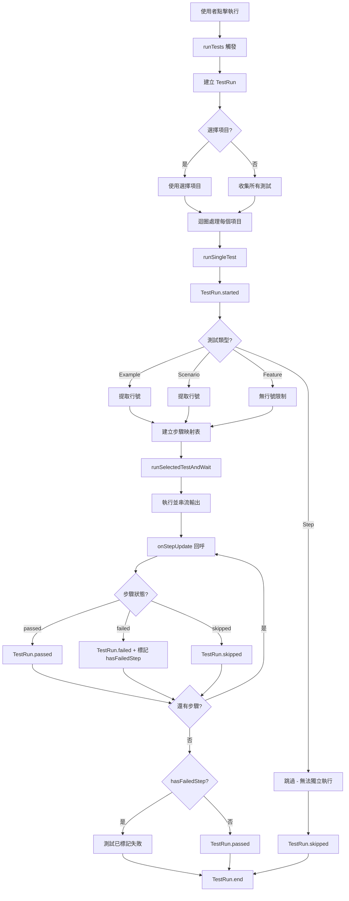

## 5. Maven 執行模式流程

```mermaid
flowchart TD
    A[runSelectedTestAndWait] --> B{executionMode?}
    B -->|maven| C[取得設定]
    B -->|java| D[Java 直接執行流程]
    C --> E{有測試類別名稱?}
    E -->|否| F{有快取?}
    E -->|是| G[使用設定的類別]
    F -->|是| H[使用快取類別]
    F -->|否| I[自動偵測測試類別]
    I --> J{找到?}
    J -->|否| K[提示使用者輸入]
    J -->|是| L[使用偵測到的類別]
    K --> M[快取測試類別]
    L --> M
    H --> N[轉換為 classpath 格式]
    G --> N
    M --> N
    N --> O[建構 Maven 參數]
    O --> P[加入 profile/tags/環境變數]
    P --> Q[建立 grep 過濾器]
    Q --> R[spawn mvn test | grep]
    R --> S[串流輸出到 parser]
    S --> T[CucumberOutputParser.parseLine]
    T --> U{偵測到步驟?}
    U -->|是| V[onStepUpdate 回呼]
    U -->|否| W[繼續讀取]
    V --> X[更新 Test Explorer]
    X --> W
    W --> Y{處理完成?}
    Y -->|否| S
    Y -->|是| Z[parser.finalize]
    Z --> AA[顯示測試摘要]
    AA --> AB[回傳 exit code]
```

## 6. 輸出解析流程 (CucumberOutputParser)

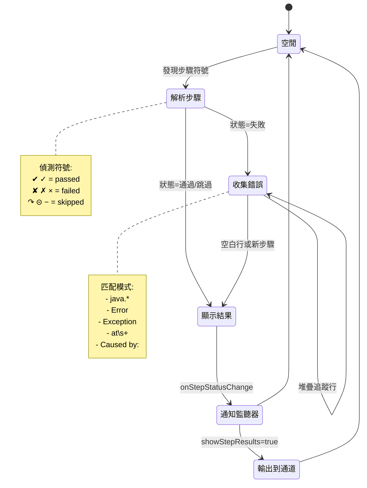

## 7. 檔案監視與更新流程

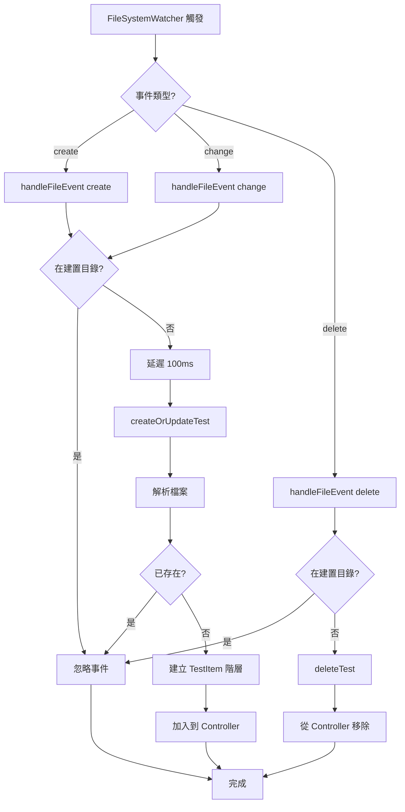

## 8. 執行模式切換流程

```mermaid
flowchart TD
    A[使用者點擊狀態列] --> B[toggleExecutionMode 指令]
    B --> C[讀取當前模式]
    C --> D{當前模式?}
    D -->|java| E[切換為 maven]
    D -->|maven| F[切換為 java]
    E --> G[更新設定]
    F --> G
    G --> H[updateExecutionModeStatusBar]
    H --> I{新模式?}
    I -->|maven| J[顯示 $(package) Maven]
    I -->|java| K[顯示 $(coffee) Java]
    J --> L[顯示通知訊息]
    K --> L
    L --> M[完成]
```

## 9. 步驟狀態即時更新流程

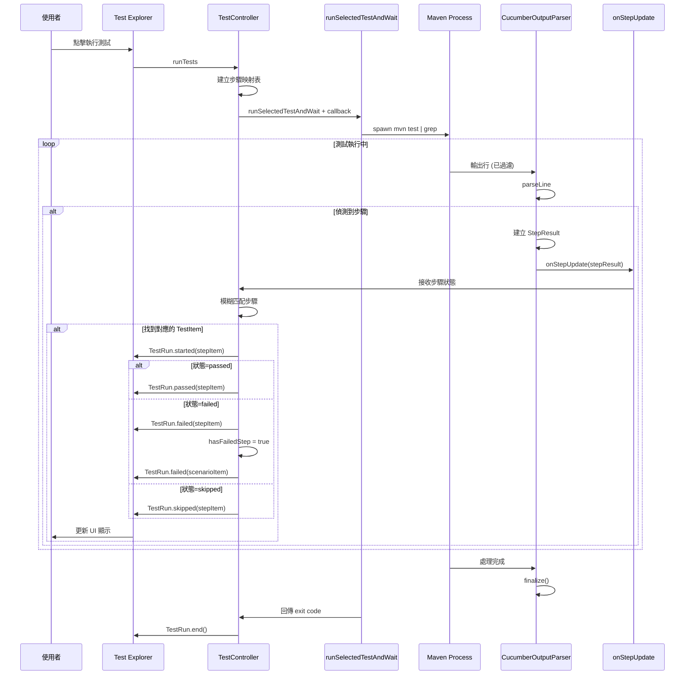

## 10. 多模組 Maven 專案支援流程

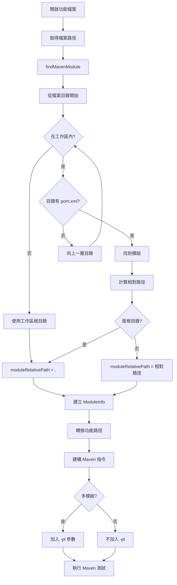

## 11. 測試類別自動偵測流程

```mermaid
flowchart TD
    A[findCucumberTestClass] --> B[定位 src/test/java]
    B --> C{目錄存在?}
    C -->|否| Z[回傳 null]
    C -->|是| D[findTestClassWithCucumberAnnotations]
    D --> E[遞迴掃描目錄]
    E --> F{是目錄?}
    F -->|是| G[遞迴處理子目錄]
    F -->|否| H{檔名結尾?}
    H -->|Test.java| I[讀取檔案內容]
    H -->|Runner.java| I
    H -->|其他| E
    I --> J{包含 Cucumber 註解?}
    J -->|@RunWith| K[提取類別名稱]
    J -->|@CucumberOptions| K
    J -->|io.cucumber| K
    J -->|否| E
    K --> L[回傳類別名稱]
    G --> M{找到?}
    M -->|是| L
    M -->|否| E
    E --> N{還有項目?}
    N -->|是| E
    N -->|否| Z
```

## 12. Glue Path 自動偵測流程

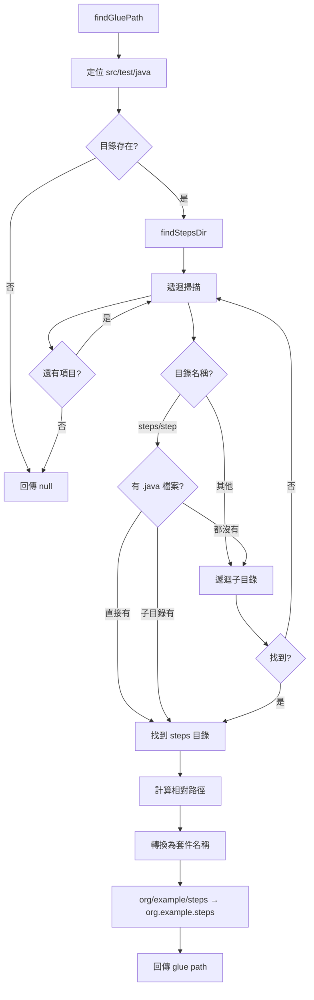

## 13. 功能檔案路徑轉換流程

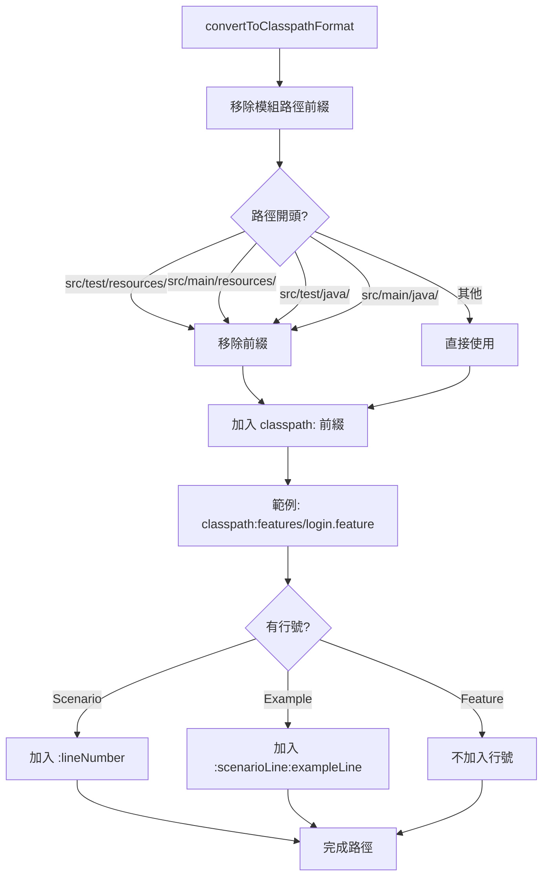

## 14. CodeLens 提供流程

```mermaid
flowchart TD
    A[provideCodeLenses] --> B{檔案類型?}
    B -->|非 .feature| Z[回傳空陣列]
    B -->|.feature| C[分割為行]
    C --> D[迴圈處理每一行]
    D --> E{行開頭?}
    E -->|Feature:| F[建立 Feature CodeLens]
    E -->|Scenario:| G[建立 Scenario CodeLens]
    E -->|Scenario Outline:| G
    E -->|管道符號 `|`| H[findExampleRowInfo]
    E -->|其他| D
    F --> I[位置: 行首, 圖示: $(play-circle)]
    G --> J[位置: 行首, 圖示: $(play)]
    H --> K{是範例資料列?}
    K -->|是| L[建立 Example CodeLens]
    K -->|否| D
    L --> M[位置: 行首, 圖示: $(play)]
    I --> N[加入到 codeLenses]
    J --> N
    M --> N
    N --> O{還有行?}
    O -->|是| D
    O -->|否| P[回傳 codeLenses 陣列]
```

## 15. 錯誤處理與使用者互動流程

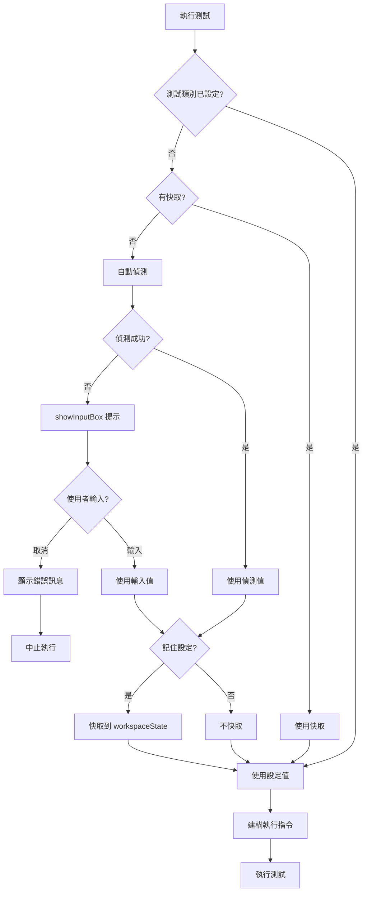

## 16. 完整測試執行生命週期

```mermaid
gantt
    title 測試執行生命週期時序圖
    dateFormat X
    axisFormat %L ms

    section 準備階段
    建立 TestRun           :0, 10
    收集測試項目           :10, 20
    建立步驟映射表         :20, 30
    
    section Maven 執行
    建構 Maven 指令        :30, 50
    啟動 Maven 處理程序    :50, 100
    
    section 即時解析
    第一個步驟執行         :100, 200
    Parser 解析輸出        :150, 210
    onStepUpdate 回呼      :210, 220
    更新 Test Explorer     :220, 230
    
    第二個步驟執行         :230, 330
    Parser 解析輸出        :280, 340
    onStepUpdate 回呼      :340, 350
    更新 Test Explorer     :350, 360
    
    第三個步驟執行         :360, 460
    Parser 解析輸出        :410, 470
    onStepUpdate 回呼      :470, 480
    更新 Test Explorer     :480, 490
    
    section 完成階段
    Maven 處理程序結束     :490, 500
    Parser.finalize        :500, 510
    顯示測試摘要           :510, 530
    TestRun.end            :530, 540
```

## 17. 資料流圖

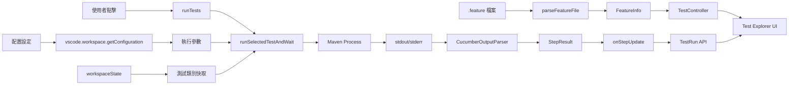

## 圖表說明

### 流程圖符號說明
- **矩形**: 處理步驟或函數
- **菱形**: 決策點或條件判斷
- **圓角矩形**: 開始/結束點
- **平行四邊形**: 輸入/輸出
- **圓柱**: 資料儲存

### 狀態圖符號說明
- **圓形**: 狀態
- **箭頭**: 狀態轉換
- **[*]**: 初始/結束狀態

### 時序圖符號說明
- **矩形**: 參與者
- **箭頭**: 訊息傳遞
- **虛線**: 回應
- **框**: 迴圈或條件區塊
